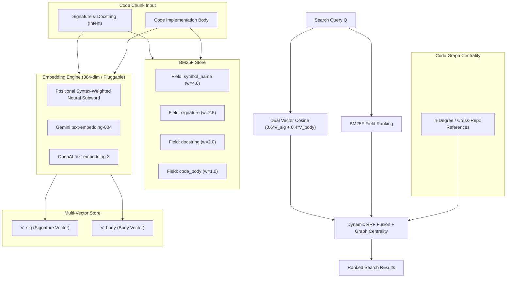

# Technical Design: Advanced Multi-Vector & BM25F Indexing Engine

- **Change ID**: `02-advanced-indexing-model`
- **Status**: DESIGNED

---

## 1. Architecture

---

## 2. Mathematical Formulations

### 2.1 Positional Syntax-Weighted Embedding
- 384-dimensional dense representation:
  - Tokens assigned positional and grammatical weights:
    - Symbol identifiers: $\times 3.0$
    - Type annotations & Keywords: $\times 2.5$
    - Docstrings & Parameter names: $\times 2.0$
    - Code body tokens: $\times 1.0$
  - Log term frequency damping: $tf_{\text{damped}} = 1 + \ln(tf)$
  - $L_2$ normalization ensures $\cos(\vec{u}, \vec{v}) = \vec{u} \cdot \vec{v}$.

### 2.2 BM25F Field-Weighted Lexical Ranking
- Field weights: $w_{\text{sym}} = 4.0, w_{\text{sig}} = 2.5, w_{\text{doc}} = 2.0, w_{\text{body}} = 1.0$
- Per-field length normalization parameters: $b_f \in [0.5, 0.85]$
- Robertson-Spärck Jones IDF with smoothing.
