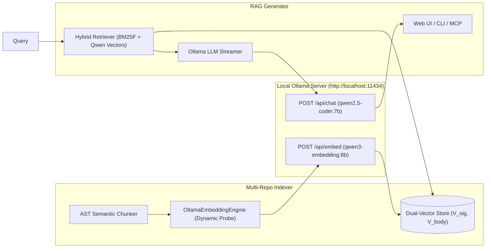

# Technical Design: Ollama Qwen3-Embedding-8B & LLM Engine

- **Change ID**: `03-ollama-dense-indexing-and-llm`
- **Status**: DESIGNED

---

## 1. System Architecture



---

## 2. API Contracts & Dynamic Dimension Detection

### 2.1 Embedding Endpoint (`/api/embed`)
- Request payload:
  ```json
  {
    "model": "qwen3-embedding:8b",
    "input": ["def verify_token(...)", "class AuthService:..."]
  }
  ```
- Response payload:
  ```json
  {
    "model": "qwen3-embedding:8b",
    "embeddings": [[0.012, -0.045, ...]]
  }
  ```
- **Fallback (`/api/embeddings`)**: If `/api/embed` is not supported on older Ollama versions, seamlessly falls back to `/api/embeddings` with `{"model": model, "prompt": text}`.

### 2.2 Chat Endpoint (`/api/chat`)
- Request payload:
  ```json
  {
    "model": "qwen2.5-coder",
    "messages": [
      {"role": "system", "content": "You are an expert codebase architect..."},
      {"role": "user", "content": "=== CONTEXT ===\n... \n=== QUERY ===\n..."}
    ],
    "stream": true,
    "options": {
      "temperature": 0.2,
      "num_ctx": 8192
    }
  }
  ```
- Streams JSON chunks with `{"message": {"content": "token"}, "done": false}`.
