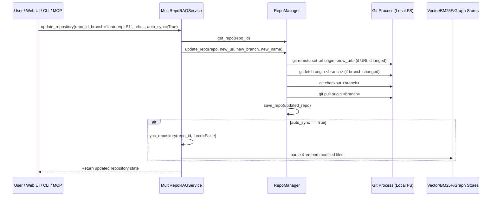

# Technical Design: Dynamic Repository Updates & Branch Switching

- **Change ID**: `04-update-repo-url-and-branch`
- **Status**: DESIGNED

---

## 1. Git Execution Flow



---

## 2. Interface Contracts

### 2.1 REST API Endpoint
`PUT /api/v1/repos/{repo_id}`

**Request Body**:
```json
{
  "name": "Update API",
  "url_or_path": "git@github.com:my-org/my-repo.git",
  "branch": "main",
  "auto_sync": true
}
```

**Response**:
```json
{
  "repo": {
    "repo_id": "update-api",
    "name": "Update API",
    "branch": "main",
    "url_or_path": "git@github.com:my-org/my-repo.git",
    "status": "ready",
    "total_files": 153,
    "total_chunks": 568
  },
  "sync_result": {
    "added_files": 0,
    "modified_files": 0,
    "total_chunks": 568
  }
}
```

### 2.2 MCP Tool
`update_repository`:
- Inputs: `repo_id` (string, required), `branch` (string, optional), `url` (string, optional), `name` (string, optional), `auto_sync` (boolean, optional).

### 2.3 CLI Command
`python3 main.py update <repo_id> [--url <url>] [--branch <branch>] [--name <name>] [--no-sync]`
