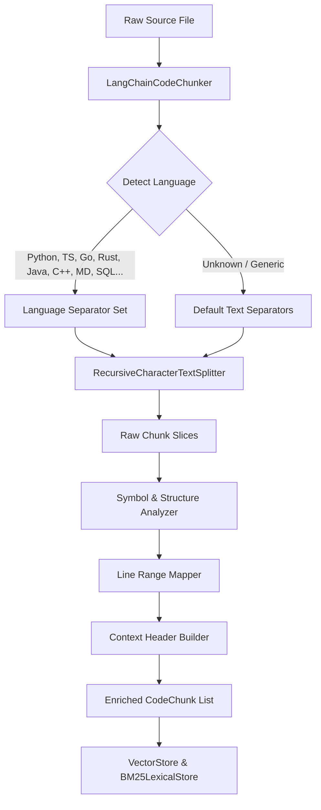

# Technical Design: LangChain-Based Code Chunking

- **Change ID**: `05-langchain-code-chunking`
- **Status**: DESIGNED

---

## 1. Architecture Overview



---

## 2. Language Separators & Recursion Hierarchy

`LangChainCodeChunker` adopts the standard LangChain `Language` delimiter hierarchies:

| Language | Primary Separators |
|---|---|
| **Python** | `\nclass `, `\ndef `, `\n\tdef `, `\n\n`, `\n`, ` `, `""` |
| **TypeScript / JS** | `\nenum `, `\ninterface `, `\nnamespace `, `\ntype `, `\nexport `, `\nclass `, `\nfunction `, `\nconst `, `\nlet `, `\nvar `, `\n\n`, `\n`, ` `, `""` |
| **Go** | `\nfunc `, `\ntype `, `\npackage `, `\nimport `, `\n\n`, `\n`, ` `, `""` |
| **Rust** | `\nfn `, `\nstruct `, `\nenum `, `\ntrait `, `\nimpl `, `\nmod `, `\n\n`, `\n`, ` `, `""` |
| **Java** | `\nclass `, `\ninterface `, `\nenum `, `\npublic `, `\nprotected `, `\nprivate `, `\n\n`, `\n`, ` `, `""` |
| **C++ / C** | `\nclass `, `\nstruct `, `\nenum `, `\nnamespace `, `\n\n`, `\n`, ` `, `""` |
| **Markdown** | `\n# `, `\n## `, `\n### `, `\n#### `, `\n##### `, `\n###### `, ````\n`, `\n\n`, `\n`, ` `, `""` |
| **HTML** | `<body>`, `<div>`, `<p>`, `<br>`, `<li>`, `\n\n`, `\n`, ` `, `""` |
| **Fallback / Text** | `\n\n`, `\n`, ` `, `""` |

---

## 3. Metadata & Context Enrichment

For each chunk generated by the recursive splitter:
1. **Accurate Line Matching**: Locate the character offset of the chunk in the file to accurately determine `start_line` and `end_line` (1-indexed).
2. **Deterministic Chunk ID**: Hash `repo_id:file_path:start_line:end_line` using SHA-256 (16-char hex).
3. **Symbol & Chunk Type Resolution**: Inspect the chunk prefix/body for signatures (classes, functions, methods, interfaces, structs, markdown headings) and classify into `ChunkType` (`FUNCTION`, `CLASS`, `METHOD`, `INTERFACE`, `STRUCT`, `DOC`, `BLOCK`).
4. **Context Headers**: Generate enriched comment header:
   ```
   // [Context] Repository: <repo_id> | File: <file_path> | Language: <language>
   // Scope: <parent_symbol> -> <symbol_name> (<chunk_type>)
   // Top Imports: <import1, import2>
   ```
   Prepended to `raw_content` to form `enriched_content`.

---

## 4. Backwards Compatibility & Migration
- `ASTChunker` class is preserved as an alias inheriting from or wrapping `LangChainCodeChunker`.
- `MultiRepoRAGService` exposes `self.chunker` and `self.ast_chunker` for 100% interoperability with existing components and tests.
