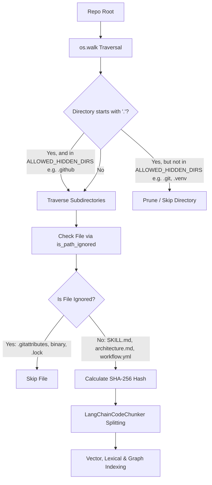

# Technical Design: Indexing `.github/skills/*` & Metadata Assets

- **Change ID**: `06-github-skills-indexing`
- **Status**: DESIGNED

---

## 1. Architecture & Traversal Flow



---

## 2. Path Filtering Rules

### `ALLOWED_HIDDEN_DIRS`
A set of top-level or intermediate directory names that start with a dot (`.`) but contain valid project documentation, skill definitions, or configurations:
```python
ALLOWED_HIDDEN_DIRS = {".github"}
```

### Directory Pruning (`scan_repository_files`)
When pruning `dirs` in `os.walk`:
```python
rel_root = os.path.relpath(root, root_path)
if rel_root == ".":
    # Root level: allow standard non-dot dirs and .github
    dirs[:] = [
        d
        for d in dirs
        if d not in DEFAULT_IGNORED_DIRS and (not d.startswith(".") or d == ".github")
    ]
elif rel_root == ".github":
    # Directly inside .github: ONLY descend into 'skills'
    dirs[:] = [d for d in dirs if d == "skills"]
else:
    # Any other subfolder: prune dot-dirs and default ignored dirs
    dirs[:] = [
        d for d in dirs if d not in DEFAULT_IGNORED_DIRS and not d.startswith(".")
    ]
```

### Path Verification (`is_path_ignored`)
When evaluating a relative file path (e.g. `.github/skills/job-polling/SKILL.md`):
1. If `parts[0] == ".github"`:
   - Enforce `len(parts) >= 2` and `parts[1] == "skills"`. Any non-skills path under `.github/` (`agents/`, `workflows/`, `prompts/`, `instructions/`, `memory.md`, etc.) returns `True` (ignored).
   - For subparts inside `skills`, ensure no component starts with `.` or is in `DEFAULT_IGNORED_DIRS`.
2. For all other root paths:
   - For every directory segment `part`: if `part in DEFAULT_IGNORED_DIRS` or `part.startswith(".")` -> `True` (ignore).
3. Check extension against `DEFAULT_IGNORED_EXTENSIONS`.
4. Match against `.gitignore` patterns.

---

## 3. Chunking & Language Mapping
Skills and prompt files match established language extensions:
- `.md` / `SKILL.md` -> `SupportedLanguage.MARKDOWN` (chunked by headers `# `, `## `, `### `, `#### `).
- `.yml` / `.yaml` -> `SupportedLanguage.YAML` (chunked by top-level keys / blocks).
- `.py` / `.template.py` -> `SupportedLanguage.PYTHON` (chunked by classes, functions, and async defs).
- Fallback text -> `SupportedLanguage.TEXT`.
